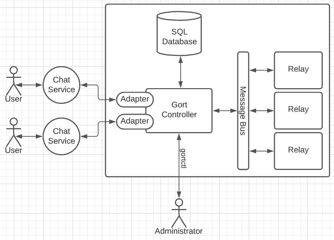

# Architecture

Gort has several parts:

* The **controller**, which (as its name suggests) acts as the central control point.

* A **data store** which stores all application state.

* One or more **chat services**, such as Slack, which can be used by users to interact with the controller and issue commands.

* One or more **relays**, which execute commands at the direction of the controller.

* A **message bus**, which is used for communication between the controller and the relays.

A high-level view of the relationships between these components is illustrated below.

## Gort Controller

The Gort controller proper. This is what you run when you deploy the Gort binary.

It lives in the [getgort/gort](https://github.com/getgort/gort) repository.

## Data Store

This stores user, group, and bundle data, as well as a backup of the transaction logs.

Gort currently supports two kinds of data stores: 

* External Postgres, intended for production purposes.

* In-memory, intended for trials, testing, and development.

## Chats

Gort's primary function is to receive messages from users in Slack (and/or other supported chat services) and execute the requested functions.

Currently Gort only supports Slack. It's possible to interact for a single Gort installation to interact with multiple chat services of the same type (multiple Slack workspaces, for example) or different types (Slack and [when supported] Discord, for example).

### Adapters

An adapter is a chat-service-specific implementation that receives messages from the service in question, translates them into standard Gort message that can be internally processed, and forwards the message to the Gort system internal for processing. They can then execute the same function in reverse, relaying messages from Gort back to the user(s).

### Chat Services

These can be any third-party chat service. Currently only Slack is supported, with more to come soon.

## Relays and Commands

Commands triggered by users and conveyed through the adapters are first parsed, compared (by name) against available commands installed as "command bundles", and forwarded to a relay for execution by a worker.

### Command Bundles

Command bundles are a set of related commands built into a Docker image or executed natively on the worker. Each bundle includes a list of the specific commands that can be executed, and a set of permission rules required to execute each command.

Command bundles can only be installed by an adequately-privileged user (generally an administrator). 

### Relays

*This section describes a planned feature that doesn't yet exist.*

Optionally, relays can be tagged with identifiers so that commands can be executed preferentially by specific relays installed in specific locations.

### Relay Workers

A worker is an ephemeral process executed by a relay to execute a command at the direction of the Gort controller. Upon completion, the process' output and status are conveyed back to the Gort controller via the message bus.

Typically (and per the specific instructions in the corresponding command bundle) a worker will function by pulling a container image and executing the image with the appropriate command and arguments.

#### Local Command Execution

*This section describes a planned feature that doesn't yet exist.*

If so directed in the command bundle (and allowed by the security settings), a worker is capable of executing a command directly on the relay's host.

## Message Bus

*This section describes a planned feature that doesn't yet exist.*

The Gort controller and the relays communicate via a dedicated message bus, typically Kafka.
